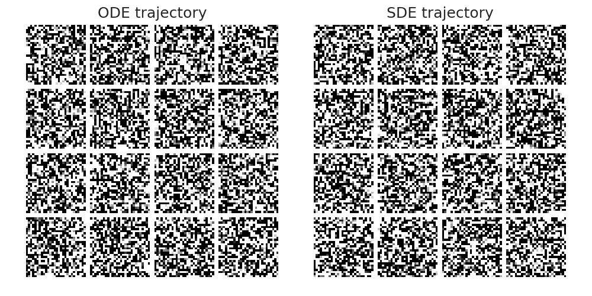

# Playground for experimenting with diffusion models 🌀

This repository includes the following:
- `diffusion` package that provides a clean, modular, and minimalistic implementation of different components and algorithms used in diffusion-based generative modeling (with references to key papers), and
- `playground` folder that contains a collection of examples that demonstrate diffusion-based generative modeling on different kinds of data (2D points, MNIST, CIFAR10, 3D point clouds, etc.)

## Diffusion

The package consists of three core modules:
1. `denoisers` module provides:
    - `KarrasDenoiser`: A thin wrapper around arbitrary neural nets that enable preconditioning of inputs and outputs, as proposed by [Karras et al., (2022)](https://arxiv.org/abs/2206.00364). The wrapper is agnostic to model architectures and only expects the shape of input and output tensors to match.
    - `KarrasOptimalDenoiser`: The optimal denoiser that corresponds to the analytical minimum of the denoising loss for a given training dataset.
2. `training` module provides functionality for training diffusion models:
    - **Loss functions ([code](https://github.com/alshedivat/diffusion-playground/blob/a58c2f68e9f76c6a056f41067a85d130dbafc4f2/diffusion/training.py#L61-L63)):** provides denoising MSE loss functions, including the original simple denoising loss of [Ho et al. (2020)](https://arxiv.org/abs/2006.11239) and preconditioned MSE loss of [Karras et al., (2022)](https://arxiv.org/abs/2206.00364).
    - **Loss weighting schemes ([code](https://github.com/alshedivat/diffusion-playground/blob/a58c2f68e9f76c6a056f41067a85d130dbafc4f2/diffusion/training.py#L18-L24)):** a collection of weighting schemes that assign different weights to losses computed for different noise levels, including the SNR-based weighting proposed by [Hang et al. (2022)](https://arxiv.org/abs/2303.09556).
    - **Noise level samplers ([code](https://github.com/alshedivat/diffusion-playground/blob/a58c2f68e9f76c6a056f41067a85d130dbafc4f2/diffusion/training.py#L124-L130)):** determine how noise levels are sampled during training at each step; the denoising loss is computed for the sampled noise levels, averaged, and optimized w.r.t. model parameters.
    - **Lightning model ([code](https://github.com/alshedivat/diffusion-playground/blob/a58c2f68e9f76c6a056f41067a85d130dbafc4f2/diffusion/training.py#L262-L264)):** a `LightningModule` class that puts all pieces together and enables training denoising models using [Pytorch Lightning](https://lightning.ai/docs/pytorch/stable/).
3. `inference` modules provides functionality for sampling from trained diffusion models:
    - **Noise schedules ([code](https://github.com/alshedivat/diffusion-playground/blob/7ae5c6d5213dff75362b514d1f430f2f13fa1aab/diffusion/inference.py#L23-L28))**
    - **ODEs ([code](https://github.com/alshedivat/diffusion-playground/blob/7ae5c6d5213dff75362b514d1f430f2f13fa1aab/diffusion/inference.py#L132-L142))**
    - **Solvers ([code](https://github.com/alshedivat/diffusion-playground/blob/7ae5c6d5213dff75362b514d1f430f2f13fa1aab/diffusion/inference.py#L341-L343))**
  

## Playground

### 1. 2D points diffusion

This is a very toy example, where each data instance is a 2D point that lies on a swiss-roll 1D manifold.
Given that the data is so simple, it's a perfect playground for experimenting with different approaches to training and inference, visualizing diffusion trajectories, and building intuition.
Both training and inference can comfortably run on a laptop (it takes a minute or so to train the model to convergence).

Colab notebook: (TODO: add link to the notebook)

### 2. MNIST diffusion

Another toy example, where diffusion model is trained on MNIST.
Model architectures are scaled down versions of the U-nets used on CIFAR10 and ImageNet benchmarks (all the architecture code is copied from https://github.com/NVlabs/edm/blob/main/training/networks.py verbatim).
It takes about 1 hour to train an MNIST denoiser in Google Colab using a T4 GPU for 20 epochs or so.
And running inference takes just a few seconds.

Colab notebook: (TODO: add link to the notebook)
