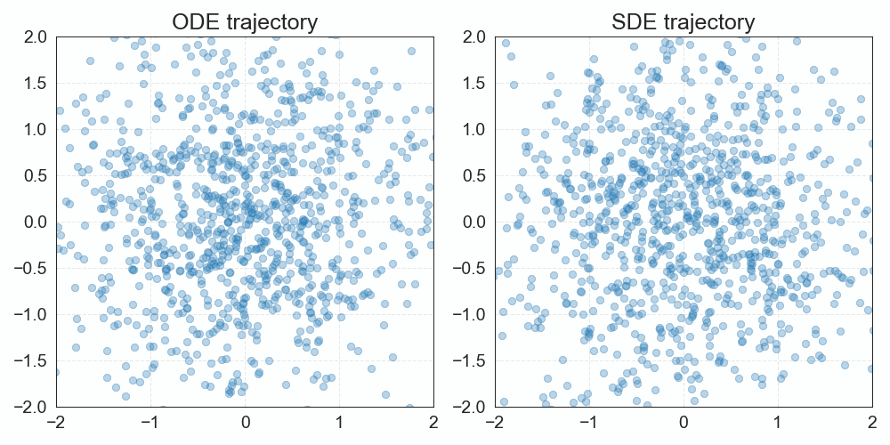

# Playground for experimenting with diffusion

This repository includes the following:
- `diffusion` package that provides a clean, modular, and minimalistic implementation of different components and algorithms used in diffusion-based generative modeling (with references to key papers), and
- `playground` folder that contains a collection of concrete examples that demonstrate diffusion-based generative modeling on different kinds of data (2D points, MNIST, CIFAR10, 3D point clouds, etc.)

## Diffusion

TODO: describe package structure

## Playground

### 1. 2D points diffusion

This is a toy example, where each data instance is a 2D point that lies on a swiss-roll 1D manifold.
Given that the data is so simple, it's a perfect playground for experimenting with different approaches to training and inference, visualizing results, and building intuition.

Colab notebook: (TODO: add link to the notebook)
